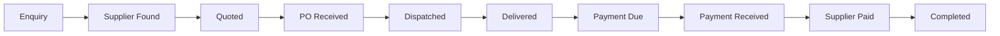
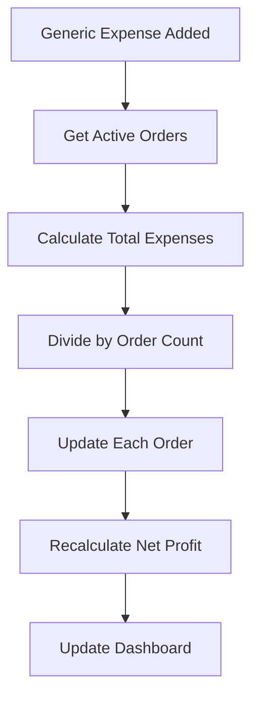
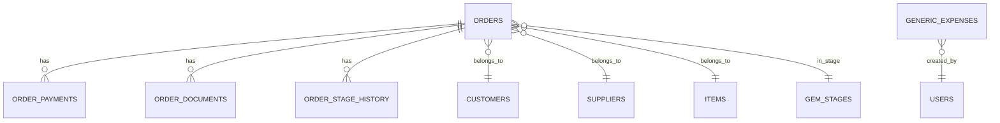

# Madhur-Asha Procurement & Order Management System - Complete Plan

## Executive Summary

Transform the existing GST calculator into a complete **Government Procurement & Order Management System** for commission-based trading business. The system will track the entire procurement lifecycle from enquiry to payment settlement, with integrated financial calculations, payment tracking, and expense management.

**Key Innovation:** Generic expenses are proportionally allocated across all active orders, providing accurate per-order profitability while maintaining overall business profit visibility.

---

## System Architecture Overview

```
┌─────────────────────────────────────────────────────────────┐
│                    PROCUREMENT SYSTEM                        │
├─────────────────────────────────────────────────────────────┤
│                                                              │
│  ┌──────────────┐  ┌──────────────┐  ┌──────────────┐     │
│  │   GeM Cycle  │  │    Orders    │  │   Expenses   │     │
│  │  (Stages)    │  │  (Central)   │  │  (Generic)   │     │
│  └──────────────┘  └──────────────┘  └──────────────┘     │
│         │                  │                  │             │
│         └──────────────────┴──────────────────┘             │
│                            │                                │
│         ┌──────────────────┴──────────────────┐            │
│         │                                      │            │
│  ┌──────▼──────┐                      ┌───────▼──────┐    │
│  │  Customers  │                      │   Suppliers  │    │
│  │   Items     │                      │   Payments   │    │
│  └─────────────┘                      └──────────────┘    │
│                                                             │
└─────────────────────────────────────────────────────────────┘
```

---

## Core Concepts

### 1. GeM Procurement Cycle (Configurable Stages)

A **configurable pipeline** that defines the stages every order goes through. Admin can:
- Create, edit, delete, and reorder stages
- Set stage names, colors, and expected duration
- Define mandatory fields/documents per stage
- Track stage history and transitions

**Default Stages:**
1. 🔍 ENQUIRY - Got requirement, searching for supplier
2. 🤝 SUPPLIER_FOUND - Got supplier price, calculating profit
3. 💰 QUOTED - Sent quote to government officer
4. 📋 PO_RECEIVED - Government raised Purchase Order
5. 🚚 DISPATCHED - Sent dispatch order + eway bill
6. ✅ DELIVERED - Customer accepted delivery
7. ⏳ PAYMENT_DUE - Waiting for government payment
8. 💵 PAYMENT_RECEIVED - Got paid from government
9. 💸 SUPPLIER_PAID - Paid supplier
10. ✔️ COMPLETED - Everything settled

### 2. Orders (Central Entity)

Every order represents one procurement transaction and contains:
- **Item Details**: What is being procured
- **Parties**: Customer (govt dept) and Supplier
- **Financials**: Purchase cost, selling price, commission, expenses, profit
- **Documents**: PO, invoices, eway bills
- **Payments**: Receivables from govt, payables to supplier
- **Stage**: Current position in GeM cycle
- **Timeline**: Audit trail of all changes
- **Allocated Expenses**: Proportional share of generic expenses

### 3. Generic Expenses & Profit Allocation

Track business expenses not tied to specific orders with intelligent profit allocation:

**How it works:**
1. Generic expenses (petrol, lunch, office supplies) are tracked separately
2. System calculates total generic expenses for a period
3. Expenses are divided equally among all **active orders** (not completed)
4. Each order shows:
   - **Order Net Profit** = Gross Profit - Commission - Order Expenses - Allocated Generic Expenses
   - **Overall Net Profit** = Sum of all Order Net Profits

**Example:**
```
Generic Expenses (Month): ₹10,000
Active Orders: 5
Allocated per Order: ₹2,000

Order #1:
  Gross Profit: ₹50,000
  Commission: ₹5,000
  Order Expenses: ₹3,000
  Allocated Generic: ₹2,000
  Order Net Profit: ₹40,000

Overall Business Net Profit = Sum of all Order Net Profits
```

**Benefits:**
- Accurate per-order profitability
- Fair expense allocation
- Clear visibility of which orders are truly profitable
- Overall business profit remains accurate

---

## Database Schema Design

### New Tables

#### 1. `gem_stages` - Configurable Procurement Stages
```sql
CREATE TABLE gem_stages (
  id SERIAL PRIMARY KEY,
  name TEXT NOT NULL,                    -- e.g., "ENQUIRY", "PO_RECEIVED"
  display_name TEXT NOT NULL,            -- e.g., "Enquiry", "PO Received"
  description TEXT,                      -- Stage description
  color TEXT NOT NULL DEFAULT '#6366f1', -- Hex color for UI
  icon TEXT,                             -- Icon name (lucide-react)
  sort_order INTEGER NOT NULL,           -- For ordering stages
  expected_duration_days INTEGER,        -- SLA in days
  is_active BOOLEAN DEFAULT true,        -- Soft delete
  is_system BOOLEAN DEFAULT false,       -- Cannot be deleted
  
  -- Mandatory fields before moving to next stage
  requires_po BOOLEAN DEFAULT false,
  requires_invoice BOOLEAN DEFAULT false,
  requires_eway_bill BOOLEAN DEFAULT false,
  requires_payment BOOLEAN DEFAULT false,
  
  created_at TIMESTAMP DEFAULT NOW(),
  updated_at TIMESTAMP DEFAULT NOW(),
  created_by INTEGER REFERENCES users(id)
);
```

#### 2. `orders` - Central Order Management
```sql
CREATE TABLE orders (
  id SERIAL PRIMARY KEY,
  order_number TEXT UNIQUE NOT NULL,     -- Auto: MAE-2026-001
  
  -- Relationships
  customer_id INTEGER REFERENCES customers(id),
  supplier_id INTEGER REFERENCES suppliers(id),
  item_id INTEGER REFERENCES items(id),
  stage_id INTEGER REFERENCES gem_stages(id),
  
  -- Item Details
  item_description TEXT NOT NULL,
  quantity DECIMAL(10,2) NOT NULL,
  unit TEXT NOT NULL,                    -- Nos, Kg, Litre, etc.
  
  -- Purchase Side (from Supplier)
  supplier_rate DECIMAL(10,2) NOT NULL,  -- Ex-GST rate
  purchase_gst_pct DECIMAL(5,2) NOT NULL,
  purchase_total_ex_gst DECIMAL(12,2),   -- Calculated
  purchase_total_inc_gst DECIMAL(12,2),  -- Calculated
  
  -- Sale Side (to Customer/Govt)
  selling_rate DECIMAL(10,2) NOT NULL,   -- Ex-GST rate
  sale_gst_pct DECIMAL(5,2) NOT NULL,
  sale_total_ex_gst DECIMAL(12,2),       -- Calculated
  sale_total_inc_gst DECIMAL(12,2),      -- Calculated
  
  -- Profit Calculation
  commission DECIMAL(10,2) DEFAULT 0,
  other_expenses DECIMAL(10,2) DEFAULT 0,
  gross_profit DECIMAL(12,2),            -- Calculated: sale - purchase
  allocated_generic_expenses DECIMAL(10,2) DEFAULT 0, -- Auto-calculated
  net_profit DECIMAL(12,2),              -- Calculated: gross - commission - expenses - allocated
  
  -- Payment Tracking - Receivable (from Govt)
  invoice_number TEXT,
  invoice_date DATE,
  invoice_amount DECIMAL(12,2),
  payment_due_date DATE,
  received_amount DECIMAL(12,2) DEFAULT 0,
  payment_received_date DATE,
  payment_status TEXT DEFAULT 'pending', -- pending, partial, paid, overdue
  
  -- Payment Tracking - Payable (to Supplier)
  supplier_invoice_number TEXT,
  supplier_invoice_date DATE,
  supplier_invoice_amount DECIMAL(12,2),
  supplier_credit_days INTEGER DEFAULT 0,
  supplier_payment_due_date DATE,
  advance_paid DECIMAL(10,2) DEFAULT 0,
  supplier_paid_amount DECIMAL(12,2) DEFAULT 0,
  supplier_payment_date DATE,
  supplier_payment_status TEXT DEFAULT 'pending',
  
  -- Documents
  po_number TEXT,
  po_date DATE,
  po_document_url TEXT,
  eway_bill_number TEXT,
  dispatch_date DATE,
  delivery_date DATE,
  
  -- Meta
  notes TEXT,
  priority TEXT DEFAULT 'normal',        -- low, normal, high, urgent
  tags TEXT[],                           -- For filtering
  
  created_at TIMESTAMP DEFAULT NOW(),
  updated_at TIMESTAMP DEFAULT NOW(),
  created_by INTEGER REFERENCES users(id)
);
```

#### 3. `order_stage_history` - Audit Trail
```sql
CREATE TABLE order_stage_history (
  id SERIAL PRIMARY KEY,
  order_id INTEGER REFERENCES orders(id) ON DELETE CASCADE,
  from_stage_id INTEGER REFERENCES gem_stages(id),
  to_stage_id INTEGER REFERENCES gem_stages(id),
  changed_by INTEGER REFERENCES users(id),
  changed_at TIMESTAMP DEFAULT NOW(),
  notes TEXT,
  duration_days INTEGER                  -- Time spent in previous stage
);
```

#### 4. `order_payments` - Payment Transactions
```sql
CREATE TABLE order_payments (
  id SERIAL PRIMARY KEY,
  order_id INTEGER REFERENCES orders(id) ON DELETE CASCADE,
  payment_type TEXT NOT NULL,            -- 'receivable' | 'payable'
  amount DECIMAL(12,2) NOT NULL,
  payment_date DATE NOT NULL,
  payment_method TEXT,                   -- Cash, Bank Transfer, Cheque, UPI
  reference_number TEXT,
  notes TEXT,
  
  created_at TIMESTAMP DEFAULT NOW(),
  created_by INTEGER REFERENCES users(id)
);
```

#### 5. `generic_expenses` - Non-Order Expenses
```sql
CREATE TABLE generic_expenses (
  id SERIAL PRIMARY KEY,
  description TEXT NOT NULL,
  amount DECIMAL(10,2) NOT NULL,
  category TEXT NOT NULL,                -- Travel, Food, Office, Utilities, Misc
  expense_date DATE NOT NULL,
  payment_method TEXT,                   -- Cash, Bank Transfer, UPI
  receipt_url TEXT,                      -- Upload receipt/bill
  notes TEXT,
  
  created_at TIMESTAMP DEFAULT NOW(),
  created_by INTEGER REFERENCES users(id)
);
```

#### 6. `order_documents` - Document Management
```sql
CREATE TABLE order_documents (
  id SERIAL PRIMARY KEY,
  order_id INTEGER REFERENCES orders(id) ON DELETE CASCADE,
  document_type TEXT NOT NULL,           -- po, invoice, eway_bill, delivery_note, other
  file_name TEXT NOT NULL,
  file_url TEXT NOT NULL,
  file_size INTEGER,
  uploaded_at TIMESTAMP DEFAULT NOW(),
  uploaded_by INTEGER REFERENCES users(id)
);
```

### Modified Tables

#### Update `calculations` table
```sql
-- NO MIGRATION NEEDED
-- Calculations table remains as-is for historical reference
-- Users can manually save important calculations as orders
-- History page will only show orders (not calculations)
```

---

## Generic Expense Allocation Logic

### Calculation Method

**Step 1: Identify Active Orders**
```sql
SELECT id, gross_profit, commission, other_expenses
FROM orders
WHERE stage_id NOT IN (SELECT id FROM gem_stages WHERE name = 'COMPLETED')
```

**Step 2: Calculate Total Generic Expenses (Period)**
```sql
SELECT SUM(amount) as total_generic_expenses
FROM generic_expenses
WHERE expense_date >= start_date AND expense_date <= end_date
```

**Step 3: Allocate to Each Order**
```javascript
const activeOrderCount = activeOrders.length
const allocatedPerOrder = totalGenericExpenses / activeOrderCount

for (const order of activeOrders) {
  order.allocated_generic_expenses = allocatedPerOrder
  order.net_profit = order.gross_profit 
                   - order.commission 
                   - order.other_expenses 
                   - order.allocated_generic_expenses
}
```

**Step 4: Calculate Overall Net Profit**
```javascript
const overallNetProfit = activeOrders.reduce((sum, order) => {
  return sum + order.net_profit
}, 0)
```

### When to Recalculate

Allocation is recalculated when:
1. A new generic expense is added
2. A generic expense is edited/deleted
3. An order stage changes (becomes active/completed)
4. Dashboard/reports are viewed (real-time calculation)

### Display in UI

**Order Detail Page:**
```
Financial Summary
├── Gross Profit: ₹50,000
├── Commission: -₹5,000
├── Order Expenses: -₹3,000
├── Allocated Generic Expenses: -₹2,000 (ℹ️ Your share of ₹10,000 across 5 orders)
└── Order Net Profit: ₹40,000
```

**Dashboard:**
```
Overall Net Profit (MTD): ₹2,45,000
├── From 12 Active Orders
└── After allocating ₹15,000 generic expenses
```

---

## API Endpoints Design

### GeM Stages Management
```
GET    /api/gem-stages              - List all stages (ordered)
POST   /api/gem-stages              - Create new stage (admin only)
PUT    /api/gem-stages/:id          - Update stage (admin only)
DELETE /api/gem-stages/:id          - Delete stage (admin only)
POST   /api/gem-stages/reorder      - Reorder stages (admin only)
```

### Orders Management
```
GET    /api/orders                  - List orders (with filters)
GET    /api/orders/:id              - Get order details (with allocated expenses)
POST   /api/orders                  - Create new order
PUT    /api/orders/:id              - Update order
DELETE /api/orders/:id              - Delete order
POST   /api/orders/:id/stage        - Move to next/specific stage
GET    /api/orders/:id/history      - Get stage history
POST   /api/orders/:id/documents    - Upload document
GET    /api/orders/pipeline         - Get pipeline view (count by stage)
GET    /api/orders/alerts           - Get payment alerts
POST   /api/orders/recalculate      - Recalculate all allocations
```

### Order Payments
```
GET    /api/orders/:id/payments     - List payments for order
POST   /api/orders/:id/payments     - Record payment
PUT    /api/orders/:id/payments/:paymentId - Update payment
DELETE /api/orders/:id/payments/:paymentId - Delete payment
```

### Generic Expenses
```
GET    /api/expenses                - List expenses (with date filters)
POST   /api/expenses                - Create expense (triggers recalculation)
PUT    /api/expenses/:id            - Update expense (triggers recalculation)
DELETE /api/expenses/:id            - Delete expense (triggers recalculation)
GET    /api/expenses/summary        - Get expense summary by category/period
POST   /api/expenses/:id/receipt    - Upload receipt
```

### Enhanced Dashboard
```
GET    /api/dashboard/stats         - Enhanced stats with pipeline & allocated expenses
GET    /api/dashboard/alerts        - Payment alerts & overdue items
GET    /api/dashboard/profit        - Overall net profit (with allocation breakdown)
```

---

## Frontend Screens & User Flows

### 1. Enhanced Dashboard (`/dashboard`)

**Layout:** Existing design with new sections

**Components:**
- **Welcome Header** (existing)
- **Quick Stats Cards** (enhanced):
  - Total Orders (by stage)
  - Active Orders
  - Overall Net Profit MTD (with allocation info)
  - Payment Due (amount)
  
- **Pipeline View** (NEW):
  ```
  [ENQUIRY: 2] → [QUOTED: 3] → [PO_RECEIVED: 1] → [DISPATCHED: 2] → [PAYMENT_DUE: 4]
  ```
  - Visual pipeline with stage counts
  - Click to filter orders by stage
  - Color-coded by stage
  
- **Payment Alerts** (NEW):
  - ⚠️ Overdue payments (red)
  - 🔔 Due in 3 days (orange)
  - ✅ Upcoming payments (green)
  
- **Recent Orders** (replaces Recent Calculations):
  - Order number, customer, item, stage, profit
  - Quick actions: View, Edit, Move Stage

**UI Elements:** Use existing Card, Badge, Button components

---

### 2. Orders List (`/orders`)

**Layout:** Similar to existing Customers/Suppliers list

**Features:**
- **View Modes:**
  - 📋 List View (default) - table with filters
  - 📊 Kanban View - cards grouped by stage
  
- **Filters:**
  - Stage (dropdown)
  - Customer (search)
  - Date range
  - Payment status
  - Priority
  
- **List Columns:**
  - Order Number
  - Customer
  - Item
  - Stage (badge with color)
  - Sale Amount
  - Order Net Profit (with allocated expenses)
  - Payment Status
  - Actions
  
- **Quick Actions:**
  - View details
  - Edit
  - Move to next stage
  - Record payment
  
- **Color Coding:**
  - 🟢 Green: On track
  - 🟡 Orange: Attention needed
  - 🔴 Red: Overdue/blocked

**UI Elements:** Table, Badge, Select, DatePicker (existing)

---

### 3. Order Detail / New Order (`/orders/:id` or `/orders/new`)

**Layout:** Single page with tabs/sections

**Sections:**

**A. Order Header**
- Order number (auto-generated)
- Stage progression bar (visual pipeline)
- Quick actions: Save, Delete, Print

**B. Basic Information**
- Customer (searchable dropdown)
- Supplier (searchable dropdown)
- Item (searchable dropdown with auto-fill)
- Quantity & Unit

**C. Financial Calculator** (embedded existing calculator)
- Purchase Side:
  - Supplier rate (ex-GST)
  - GST %
  - Total (auto-calculated)
  
- Sale Side:
  - Selling rate (ex-GST)
  - GST %
  - Total (auto-calculated)
  
- Profit Calculation:
  - Gross Profit (auto)
  - Commission
  - Order expenses
  - **Allocated Generic Expenses** (auto, with tooltip)
  - **Order Net Profit** (auto)

**Allocated Expenses Tooltip:**
```
ℹ️ Allocated Generic Expenses: ₹2,000

This is your order's share of ₹10,000 in generic 
business expenses (petrol, lunch, etc.) divided 
across 5 active orders this month.

This gives you accurate per-order profitability.
```

**D. Payment Tracking**
- **Receivable (from Govt):**
  - Invoice details
  - Due date
  - Received amount
  - Balance
  - Payment history
  
- **Payable (to Supplier):**
  - Supplier invoice
  - Credit days
  - Advance paid
  - Balance due
  - Payment history

**E. Documents**
- PO upload
- Invoice upload
- Eway bill
- Other documents
- Preview & download

**F. Timeline/Notes**
- Stage history
- Notes/comments
- Activity log

**UI Elements:** Form, Input, Select, DatePicker, FileUpload, Tabs (existing)

---

### 4. Generic Expenses (`/expenses`)

**Layout:** Simple list with add/edit dialog

**Features:**
- **List View:**
  - Date
  - Description
  - Category (badge)
  - Amount
  - Receipt (icon if uploaded)
  - Actions
  
- **Filters:**
  - Date range (MTD, QTD, YTD, Custom)
  - Category
  
- **Summary Cards:**
  - Total expenses (period)
  - By category breakdown
  - **Allocation Info**: "Divided across X active orders = ₹Y per order"
  - Chart/graph (optional)
  
- **Add/Edit Dialog:**
  - Description
  - Amount
  - Category (dropdown: Travel, Food, Office, Utilities, Misc)
  - Date
  - Payment method
  - Receipt upload
  - Notes

**Note:** After adding/editing expense, show toast: "Expense saved. Order profits recalculated."

**UI Elements:** Table, Dialog, Select, DatePicker, FileUpload (existing)

---

### 5. GeM Stage Management (`/settings/stages`)

**Layout:** Admin-only settings page

**Features:**
- **Stage List:**
  - Drag-to-reorder
  - Stage name, color, icon
  - Expected duration
  - Active/Inactive toggle
  - Edit/Delete actions
  
- **Add/Edit Stage Dialog:**
  - Name & Display name
  - Description
  - Color picker
  - Icon selector
  - Expected duration (days)
  - Mandatory requirements checkboxes:
    - [ ] Requires PO
    - [ ] Requires Invoice
    - [ ] Requires Eway Bill
    - [ ] Requires Payment

**UI Elements:** DragDrop, ColorPicker, Dialog, Checkbox (existing + new)

---

### 6. Enhanced Calculator (`/calculator`)

**Changes:**
- Keep existing calculator functionality
- Add "Save as Order" button
- When clicked, opens dialog to:
  - Select customer
  - Select supplier
  - Select item
  - Set initial stage
  - Creates order with financial data pre-filled

**UI Elements:** Existing calculator + Dialog

---

### 7. History Page (`/history`)

**IMPORTANT CHANGE:**
- **Remove calculations from history**
- Show only orders
- Users can delete old calculations manually
- Important calculations can be saved as orders using "Save as Order" button

**New Layout:**
- Title: "Order History"
- Filter by date range, customer, stage
- Show completed and active orders
- No migration button needed

---

## Phase-wise Implementation Strategy

### Phase 1: Foundation & Core Tables (Week 1-2)
**Goal:** Set up database schema and basic CRUD operations

**Tasks:**
1. Create `gem_stages` table with default stages
2. Create `orders` table with all fields including `allocated_generic_expenses`
3. Create `order_stage_history` table
4. Create `order_payments` table
5. Create `generic_expenses` table
6. Create `order_documents` table
7. Create API endpoints for stages CRUD
8. Create API endpoints for orders CRUD
9. Create API endpoints for expenses CRUD
10. Implement expense allocation calculation logic

**Deliverables:**
- ✅ All tables created
- ✅ Basic API endpoints working
- ✅ Allocation logic implemented
- ✅ Postman/API tests passing

---

### Phase 2: Orders Module (Week 3-4)
**Goal:** Build complete order management UI

**Tasks:**
1. Create Orders List page (`/orders`)
   - List view with filters
   - Search and pagination
   - Color-coded status
   - Show allocated expenses in profit column
   
2. Create Order Detail page (`/orders/:id`)
   - All sections (basic info, financials, payments, documents)
   - Embed calculator component
   - Stage progression UI
   - Show allocated generic expenses with tooltip
   
3. Create New Order page (`/orders/new`)
   - Form with validation
   - Auto-calculations including allocation
   - Save functionality
   
4. Implement stage transitions
   - Move to next stage
   - Stage history tracking
   - Validation rules
   - Trigger allocation recalculation
   
5. Implement payment recording
   - Add payment dialog
   - Update order status
   - Payment history

**Deliverables:**
- ✅ Orders list working
- ✅ Create/edit orders working
- ✅ Stage transitions working
- ✅ Payment tracking working
- ✅ Allocated expenses displayed correctly

---

### Phase 3: Enhanced Dashboard & Alerts (Week 5)
**Goal:** Build pipeline view and payment alerts

**Tasks:**
1. Update dashboard API to include:
   - Pipeline counts by stage
   - Payment alerts (overdue, due soon)
   - Overall net profit with allocation breakdown
   
2. Create Pipeline View component
   - Visual stage progression
   - Click to filter
   - Color-coded
   
3. Create Payment Alerts component
   - Overdue items (red)
   - Due soon (orange)
   - Upcoming (green)
   
4. Update Recent Orders section
   - Replace calculations with orders
   - Show stage and status
   - Show order net profit
   
5. Add quick actions
   - Record payment
   - Move stage
   - View order

**Deliverables:**
- ✅ Enhanced dashboard with pipeline
- ✅ Payment alerts working
- ✅ Overall profit calculation accurate
- ✅ Quick actions functional

---

### Phase 4: Generic Expenses Module (Week 6)
**Goal:** Track non-order business expenses with allocation

**Tasks:**
1. Create Expenses List page (`/expenses`)
   - Table with filters
   - Date range selection
   - Category filter
   - Show allocation info
   
2. Create Add/Edit Expense dialog
   - Form with validation
   - Category dropdown
   - Receipt upload
   - Trigger recalculation on save
   
3. Create Expense Summary component
   - Total by period
   - Breakdown by category
   - Allocation visualization
   - Optional chart
   
4. Implement allocation recalculation
   - Trigger on expense add/edit/delete
   - Update all active orders
   - Show toast notification
   
5. Update profit calculations
   - Deduct allocated expenses
   - Show in dashboard
   - Monthly/quarterly reports

**Deliverables:**
- ✅ Expenses CRUD working
- ✅ Receipt upload working
- ✅ Allocation recalculation working
- ✅ Summary reports accurate
- ✅ Overall net profit calculation correct

---

### Phase 5: Stage Management & Configuration (Week 7)
**Goal:** Allow admin to configure GeM stages

**Tasks:**
1. Create Stage Management page (`/settings/stages`)
   - List all stages
   - Drag-to-reorder
   - Add/edit/delete
   
2. Create Stage Editor dialog
   - All stage properties
   - Color picker
   - Icon selector
   - Mandatory requirements
   
3. Implement stage reordering
   - Drag-and-drop
   - Update sort_order
   - Reflect in all UIs
   
4. Add stage validation
   - Check mandatory fields
   - Prevent invalid transitions
   - Show warnings

**Deliverables:**
- ✅ Stage management UI working
- ✅ Reordering functional
- ✅ Stage validation working

---

### Phase 6: Calculator Integration (Week 8)
**Goal:** Integrate calculator with orders

**Tasks:**
1. Update Calculator page
   - Add "Save as Order" button
   - Create order dialog
   - Pre-fill financial data
   
2. Add "Quick Calculate" mode
   - Standalone calculator
   - No order creation
   - Just calculations
   
3. Update History page
   - Remove calculations
   - Show only orders
   - Add filters

**Deliverables:**
- ✅ Calculator integration complete
- ✅ History page updated
- ✅ No migration needed

---

### Phase 7: Documents & Polish (Week 9)
**Goal:** Document management and UI polish

**Tasks:**
1. Implement document upload
   - PO, Invoice, Eway bill
   - Other documents
   - Preview functionality
   
2. Add document validation
   - File type checks
   - Size limits
   - Required documents per stage
   
3. Create document viewer
   - Preview PDFs
   - Download option
   - Delete option
   
4. UI polish
   - Loading states
   - Error handling
   - Success messages
   - Responsive design
   
5. Performance optimization
   - Query optimization
   - Caching
   - Lazy loading

**Deliverables:**
- ✅ Document management working
- ✅ UI polished and responsive
- ✅ Performance optimized

---

### Phase 8: Reports & Analytics (Week 10)
**Goal:** Business intelligence and reporting

**Tasks:**
1. Create Reports page (`/reports`)
   - Overall profit by period
   - Orders by stage
   - Customer analysis
   - Supplier analysis
   - Expense breakdown
   
2. Add export functionality
   - Export to Excel
   - Export to PDF
   - Custom date ranges
   
3. Create analytics dashboard
   - Charts and graphs
   - Trends over time
   - Key metrics
   - Allocation insights
   
4. Add email notifications (optional)
   - Payment reminders
   - Overdue alerts
   - Stage transitions

**Deliverables:**
- ✅ Reports page working
- ✅ Export functionality
- ✅ Analytics dashboard
- ✅ Allocation reports accurate

---

## Technical Considerations

### 1. No Migration Needed
- Existing `calculations` table remains untouched
- Users can manually save important calculations as orders
- History page shows only orders
- Clean separation between old and new system

### 2. Auto-calculations
All financial fields auto-calculate on input change:
```javascript
// Purchase side
purchaseTotalExGst = supplierRate * quantity
purchaseTotalIncGst = purchaseTotalExGst * (1 + purchaseGstPct/100)

// Sale side
saleTotalExGst = sellingRate * quantity
saleTotalIncGst = saleTotalExGst * (1 + saleGstPct/100)

// Profit
grossProfit = saleTotalExGst - purchaseTotalExGst

// Get allocated generic expenses
allocatedGenericExpenses = calculateAllocation(orderId)

// Final net profit
netProfit = grossProfit - commission - otherExpenses - allocatedGenericExpenses
```

### 3. Allocation Calculation Performance
```javascript
// Cache allocation for 5 minutes
const ALLOCATION_CACHE_TTL = 5 * 60 * 1000

async function calculateAllocation(period = 'current_month') {
  const cacheKey = `allocation:${period}`
  const cached = await cache.get(cacheKey)
  if (cached) return cached
  
  // Calculate fresh
  const activeOrders = await getActiveOrders()
  const totalExpenses = await getTotalGenericExpenses(period)
  const perOrder = totalExpenses / activeOrders.length
  
  await cache.set(cacheKey, perOrder, ALLOCATION_CACHE_TTL)
  return perOrder
}
```

### 4. Payment Status Logic
```javascript
// Receivable status
if (receivedAmount === 0) status = 'pending'
else if (receivedAmount < invoiceAmount) status = 'partial'
else if (receivedAmount >= invoiceAmount) status = 'paid'
if (paymentDueDate < today && status !== 'paid') status = 'overdue'

// Payable status (similar logic)
```

### 5. Stage Transition Rules
- Can only move forward (or manually select any stage)
- Check mandatory requirements before transition
- Record in stage_history
- Calculate duration in previous stage
- Update order.updated_at
- Trigger allocation recalculation if stage affects active status

### 6. Order Number Generation
```javascript
// Format: MAE-YYYY-NNN
// Example: MAE-2026-001, MAE-2026-002
const year = new Date().getFullYear()
const lastOrder = await getLastOrderOfYear(year)
const nextNumber = (lastOrder?.number || 0) + 1
const orderNumber = `MAE-${year}-${String(nextNumber).padStart(3, '0')}`
```

### 7. UI/UX Consistency
- **Colors:** Use existing theme colors from tailwind.config
- **Fonts:** Use existing font-display and font-sans
- **Components:** Reuse all existing shadcn/ui components
- **Spacing:** Follow existing spacing patterns
- **Icons:** Use lucide-react icons (already in use)
- **Animations:** Use existing animate-in, fade-in patterns
- **Cards:** Use existing Card component styles
- **Forms:** Use existing Form, Input, Select patterns

### 8. Performance Optimization
- Paginate orders list (20 per page)
- Index on order_number, customer_id, supplier_id, stage_id
- Cache dashboard stats (5 min TTL)
- Cache allocation calculation (5 min TTL)
- Lazy load documents
- Optimize queries with proper joins

---

## Success Metrics

### Phase 1-2 (Foundation & Orders)
- ✅ All tables created
- ✅ Orders CRUD working
- ✅ Can create order from scratch
- ✅ Can track stage progression
- ✅ Allocation calculation working

### Phase 3-4 (Dashboard & Expenses)
- ✅ Pipeline view shows real-time data
- ✅ Payment alerts working
- ✅ Generic expenses tracked
- ✅ Allocation displayed correctly
- ✅ Overall net profit accurate

### Phase 5-6 (Configuration & Integration)
- ✅ Admin can configure stages
- ✅ Calculator integrated with orders
- ✅ History shows only orders
- ✅ No migration needed

### Phase 7-8 (Polish & Reports)
- ✅ Document management working
- ✅ UI responsive and polished
- ✅ Reports generated correctly
- ✅ Allocation insights available
- ✅ System ready for production

---

## Risk Mitigation

### Risk 1: Complex Allocation Logic
**Mitigation:**
- Clear documentation of calculation
- Unit tests for allocation function
- Cache results for performance
- Show breakdown in UI for transparency

### Risk 2: Performance with Many Orders
**Mitigation:**
- Add database indexes
- Implement pagination
- Cache allocation calculation
- Monitor query performance

### Risk 3: User Understanding of Allocation
**Mitigation:**
- Clear tooltips explaining allocation
- Visual breakdown in UI
- Help documentation
- Example calculations

### Risk 4: UI Consistency
**Mitigation:**
- Reuse existing components
- Follow existing design patterns
- No new colors or fonts
- Maintain familiar UX

---

## Next Steps

1. **Review this plan** - Confirm all requirements are covered
2. **Approve phase sequence** - Adjust if needed
3. **Start Phase 1** - Database schema and allocation logic
4. **Iterative development** - Complete one phase at a time
5. **User feedback** - Test after each phase

---

## Appendix: Mermaid Diagrams

### Order Lifecycle Flow


### Expense Allocation Flow


### Data Model Relationships


---

**Document Version:** 2.0  
**Last Updated:** 2026-04-04  
**Status:** Ready for Implementation  
**Key Changes:** 
- Removed migration requirement
- Added expense allocation logic
- Updated History page to show only orders
- Enhanced profit calculation with allocation