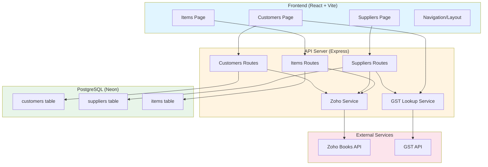
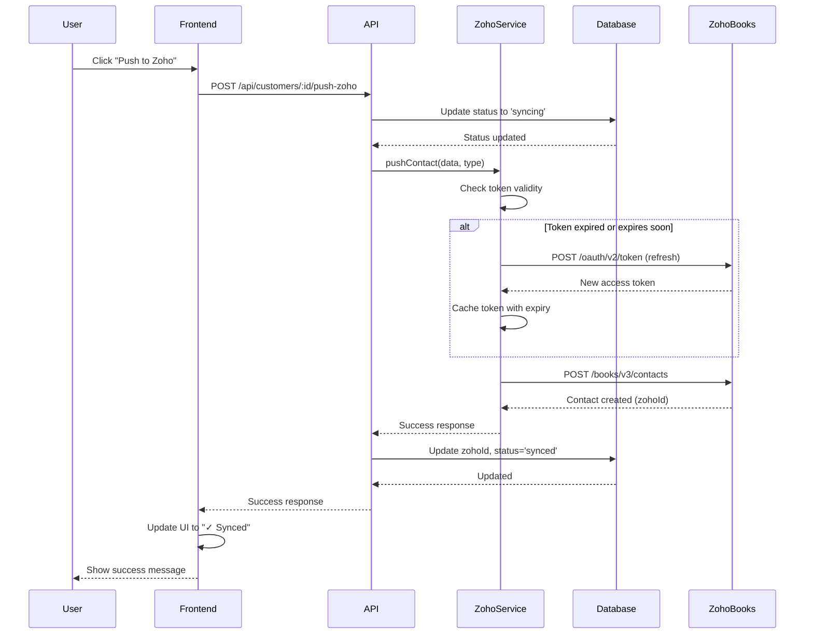
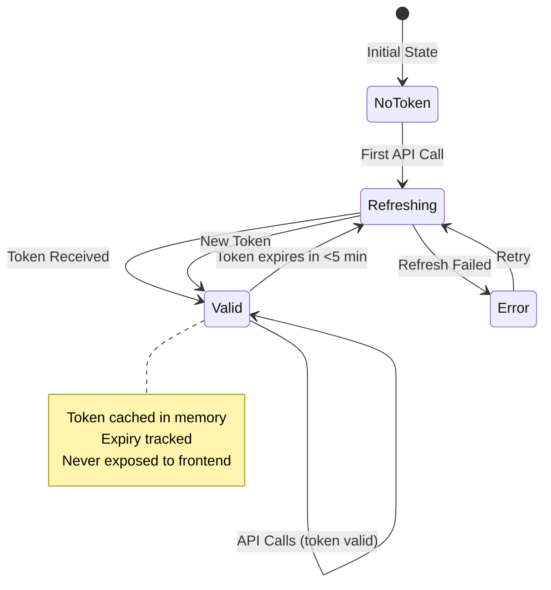
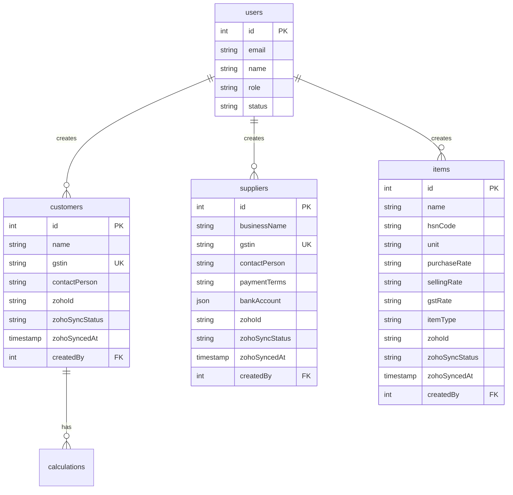
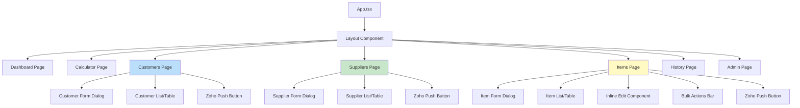
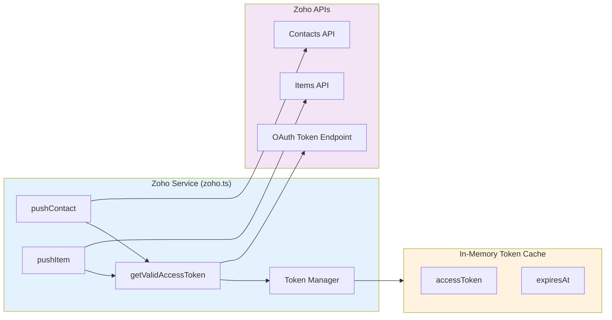
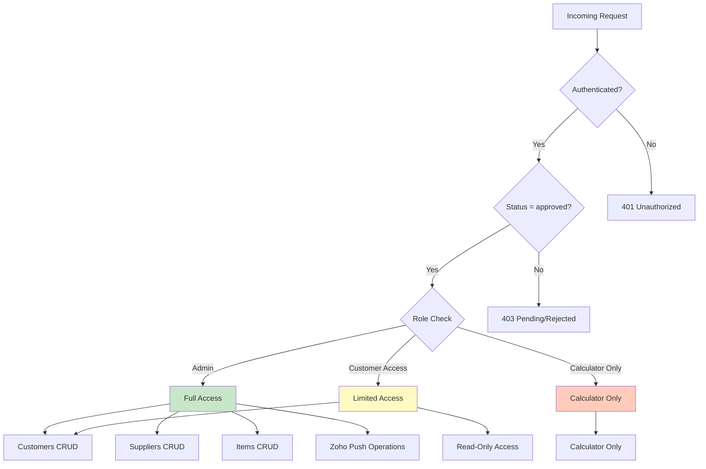
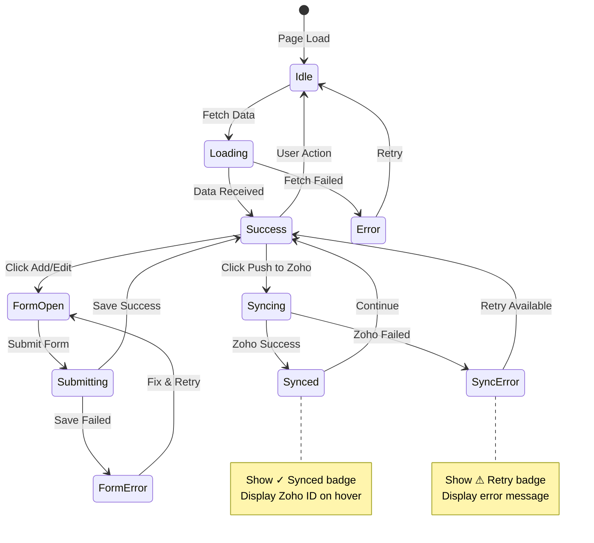
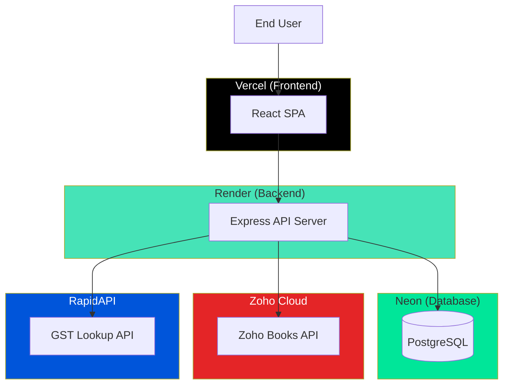
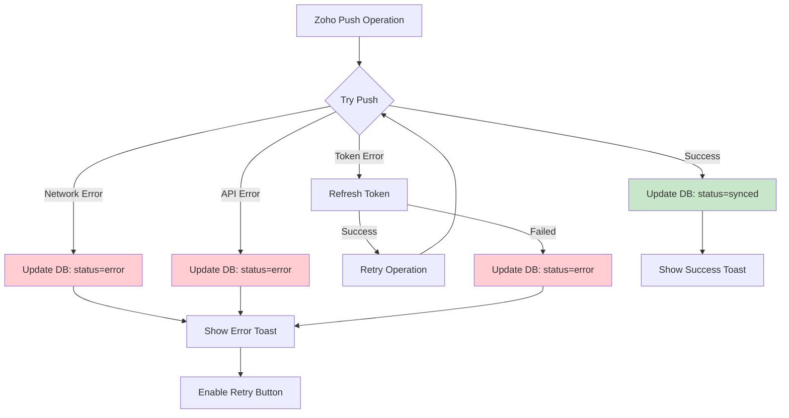

# Zoho Integration Architecture

## System Architecture Overview



## Data Flow - Zoho Push Operation



## Token Management Flow



## Database Schema Relationships



## Component Hierarchy



## API Endpoint Structure

```
/api
├── /auth
│   ├── GET  /me
│   └── POST /logout
├── /users
│   ├── GET  /
│   └── POST /:id/approve
├── /gst
│   └── GET  /lookup?gstin=xxx
├── /customers
│   ├── GET    /
│   ├── POST   /
│   ├── GET    /:id
│   ├── PUT    /:id
│   ├── DELETE /:id
│   └── POST   /:id/push-zoho ⭐ NEW
├── /suppliers ⭐ NEW
│   ├── GET    /
│   ├── POST   /
│   ├── GET    /:id
│   ├── PUT    /:id
│   ├── DELETE /:id
│   └── POST   /:id/push-zoho
├── /items ⭐ NEW
│   ├── GET    /
│   ├── POST   /
│   ├── GET    /:id
│   ├── PUT    /:id
│   ├── DELETE /:id
│   ├── POST   /:id/push-zoho
│   └── POST   /bulk-push-zoho
├── /calculations
│   ├── GET  /
│   ├── POST /
│   └── GET  /:id
└── /dashboard
    └── GET  /stats
```

## Zoho Service Internal Architecture



## Security & Access Control



## Frontend State Management



## Deployment Architecture



## Error Handling Flow



## Key Design Decisions

### 1. Token Management
- **In-memory cache**: Tokens stored in server memory, never in database
- **Automatic refresh**: Check expiry before each API call
- **5-minute buffer**: Refresh if token expires within 5 minutes
- **Security**: Tokens never exposed to frontend

### 2. Database Design
- **Separate tables**: Customers, Suppliers, Items are distinct entities
- **Zoho fields**: Consistent across all tables (zohoId, zohoSyncStatus, etc.)
- **JSON storage**: Bank account details stored as JSON for flexibility
- **Audit trail**: createdBy, createdAt, updatedAt for all entities

### 3. Frontend Architecture
- **Component reuse**: Same UI components across all pages
- **Design consistency**: Exact match of colors, fonts, spacing
- **Responsive design**: Desktop table + mobile cards pattern
- **State management**: React Query for server state, useState for UI state

### 4. API Design
- **RESTful**: Standard CRUD operations
- **Consistent patterns**: Same structure for all entity routes
- **Role-based access**: Admin-only for Zoho operations
- **Error handling**: Consistent error responses

### 5. Bulk Operations
- **Sequential processing**: Items pushed one at a time
- **Progress tracking**: Individual status for each item
- **Partial success**: Continue on error, report all results
- **User feedback**: Real-time progress updates

## Performance Considerations

1. **Token Caching**: Reduces OAuth calls by ~99%
2. **Database Indexing**: GSTIN fields indexed for fast lookups
3. **Lazy Loading**: Frontend loads data on demand
4. **Optimistic Updates**: UI updates before server confirmation
5. **Debounced Search**: Reduces API calls during typing

## Security Measures

1. **Server-side tokens**: Zoho credentials never exposed
2. **Role-based access**: Admin-only for sensitive operations
3. **Input validation**: Both frontend and backend validation
4. **SQL injection prevention**: Parameterized queries via Drizzle ORM
5. **CORS protection**: Strict origin checking
6. **Session security**: HTTP-only cookies, secure in production